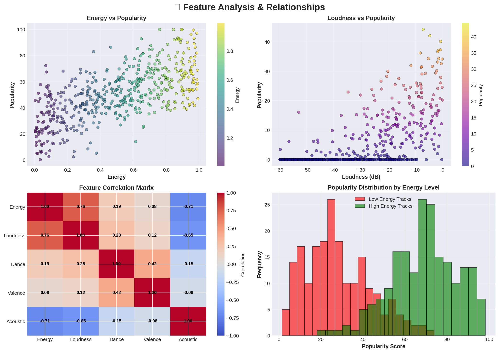

<div align="center">

# 🎵 Análise de Popularidade de Músicas no Spotify

[](https://www.python.org/downloads/)
[](https://opensource.org/licenses/MIT)
[](https://github.com/psf/black)
[](https://github.com/features/actions)
[](https://www.docker.com/)
[](https://streamlit.io/)
[](https://fastapi.tiangolo.com/)

**Análise Avançada de Machine Learning sobre Popularidade de Músicas no Spotify**

[🎓 Apresentação](apresentacao.html) • [📖 Documentação](docs/) • [🔬 Relatório Técnico](docs/relatorio_tecnico.md) • [🚀 Início Rápido](#-início-rápido)

</div>

---

## 📋 Índice

- [Visão Geral](#-visão-geral)
- [Funcionalidades](#-funcionalidades)
- [Arquitetura](#-arquitetura)
- [Início Rápido](#-início-rápido)
- [Instalação](#-instalação)
- [Uso](#-uso)
- [Estrutura do Projeto](#-estrutura-do-projeto)
- [Metodologia](#-metodologia)
- [Resultados](#-resultados)
- [Tecnologias](#-tecnologias)
- [Documentação da API](#-documentação-da-api)
- [Contribuindo](#-contribuindo)
- [Licença](#-licença)
- [Citação](#-citação)
- [Contato](#-contato)

---

## 🎯 Visão Geral

Este projeto implementa um **pipeline completo de machine learning de ponta a ponta** para predizer a popularidade de músicas no Spotify usando a **metodologia CRISP-DM**. Combina aprendizado supervisionado (Regressão e Classificação), aprendizado não supervisionado (Clustering) e sistemas de recomendação para fornecer insights abrangentes sobre o que torna a música popular.

### 🎓 Contexto Acadêmico

- **Curso:** Ciência de Dados & Machine Learning
- **Autor:** Geyson de Araujo
- **Data:** Dezembro 2025
- **Instituição:** Projeto de Pesquisa Acadêmica

### 🎤 Problema de Negócio

*Como podemos prever a popularidade de músicas com base em características intrínsecas de áudio para ajudar artistas, gravadoras e plataformas de streaming a tomar decisões baseadas em dados?*

---

## ✨ Funcionalidades

### 🔬 Modelos de Machine Learning
- **6 Modelos de Regressão:** Ridge, Lasso, ElasticNet, Random Forest, Gradient Boosting, XGBoost
- **Classificação:** Categorização multi-classe de popularidade
- **Clustering:** K-Means para descoberta de perfis musicais
- **Sistema de Recomendação:** Filtragem baseada em conteúdo usando similaridade de cosseno

### 📊 Dashboards Interativos
- **Dashboard Streamlit:** Interface de visualização e predição em tempo real
- **Visualizações Plotly:** Gráficos e plots interativos
- **Comparação de Modelos:** Métricas de desempenho lado a lado

### 🚀 Funcionalidades Prontas para Produção
- **API REST:** Microsserviço baseado em FastAPI para predições
- **Suporte Docker:** Implantação containerizada com Docker Compose
- **Pipeline CI/CD:** Testes automatizados e verificações de qualidade
- **Testes Abrangentes:** Testes unitários e de integração com pytest
- **Segurança de Tipos:** Type hints completos com validação mypy
- **Qualidade de Código:** Integração com Black, isort, flake8 e bandit

### 📈 Análises Avançadas
- **Importância de Features:** Análise SHAP e importância baseada em árvores
- **Validação Cruzada:** Avaliação robusta de modelos
- **Ajuste de Hiperparâmetros:** Configurações otimizadas de modelos
- **Interpretabilidade do Modelo:** Explicações claras das predições

---

## 🎬 Capturas de Tela e Apresentação

### 📸 Visão Visual

<div align="center">

#### 🖥️ Dashboard Interativo

*Dashboard Streamlit com predições em tempo real, comparação de modelos e visualizações interativas*

#### 🚀 Documentação da API REST

*Interface OpenAPI do FastAPI com teste interativo de endpoints*

#### 🏗️ Arquitetura do Sistema

*Arquitetura pronta para produção com múltiplas interfaces e implantação Docker*

#### 📊 Resultados do Modelo e Insights

*Comparação abrangente de desempenho e principais descobertas*

#### 🔍 Análise de Features

*Importância de features, correlações e relacionamentos*

</div>

### 🎓 Apresentação Acadêmica

📊 **[Veja a apresentação interativa](apresentacao.html)** - Slides profissionais cobrindo:
- Visão geral do projeto e metodologia
- Arquitetura técnica e implementação
- Resultados e insights de machine learning
- Implantação em produção e funcionalidades

Abra `apresentacao.html` no seu navegador para uma apresentação em tela cheia e navegável construída com Reveal.js.

---

## 🏗️ Arquitetura

<div align="center">

```
┌─────────────────┐         ┌──────────────────┐
│  Fontes de      │────────▶│  Pipeline de     │
│  Dados (API     │         │  Dados (Pré-     │
│  Spotify)       │         │  processamento)  │
└─────────────────┘         └──────────────────┘
                                     │
                                     ▼
                            ┌──────────────────┐
                            │  Modelos ML      │
                            │  (6 Regressores) │
                            └──────────────────┘
                                     │
                    ┌────────────────┼────────────────┐
                    ▼                ▼                ▼
            ┌──────────────┐  ┌──────────────┐  ┌──────────────┐
            │  API REST    │  │  Dashboard   │  │  Jupyter     │
            │  (FastAPI)   │  │  (Streamlit) │  │  Notebooks   │
            └──────────────┘  └──────────────┘  └──────────────┘
```

</div>

---

## 🚀 Início Rápido

### Usando Docker (Recomendado)

```bash
# Clone o repositório
git clone https://github.com/tavs-coelho/An-lise-Spotify.git
cd An-lise-Spotify

# Inicie todos os serviços com Docker Compose
docker-compose up -d

# Acesse os serviços
# - Documentação da API: http://localhost:8000/docs
# - Dashboard Streamlit: http://localhost:8501
```

### Desenvolvimento Local

```bash
# 1. Clone e navegue
git clone https://github.com/tavs-coelho/An-lise-Spotify.git
cd An-lise-Spotify

# 2. Crie ambiente virtual
python -m venv venv
source venv/bin/activate  # No Windows: venv\Scripts\activate

# 3. Instale dependências
pip install -r requirements.txt
pip install -e .

# 4. Execute a aplicação
# Opção A: Dashboard Streamlit
streamlit run app.py

# Opção B: Servidor FastAPI
uvicorn api:app --reload

# Opção C: Jupyter Notebook
jupyter notebook analise_completa_final.ipynb
```

---

## 📦 Instalação

### Pré-requisitos

- **Python 3.8+** (3.10 recomendado)
- **pip** (versão mais recente)
- **Git**
- **Docker & Docker Compose** (opcional, para implantação containerizada)

### Instalação Passo a Passo

#### 1. Clone o Repositório

```bash
git clone https://github.com/tavs-coelho/An-lise-Spotify.git
cd An-lise-Spotify
```

#### 2. Crie Ambiente Virtual

```bash
# Usando venv
python -m venv venv
source venv/bin/activate  # Linux/Mac
# venv\Scripts\activate   # Windows

# Ou usando conda
conda create -n spotify-analysis python=3.10
conda activate spotify-analysis
```

#### 3. Instale Dependências

```bash
# Instale dependências principais
pip install -r requirements.txt

# Instale o pacote em modo de desenvolvimento
pip install -e .

# Opcional: Instale dependências de desenvolvimento
pip install -r requirements-dev.txt  # Se existir
```

#### 4. Baixe o Dataset (Opcional)

O projeto funciona com dados de amostra, mas para análise completa:

```bash
# Baixe do Kaggle (requer API do Kaggle)
kaggle datasets download -d zaheenhamidani/ultimate-spotify-tracks-db
unzip ultimate-spotify-tracks-db.zip -d data/
```

---

## 💻 Uso

### 1. Dashboard Interativo

Lance o dashboard Streamlit para exploração interativa:

```bash
streamlit run app.py
```

Funcionalidades:
- 📊 Explore estatísticas e distribuições dos dados
- 🤖 Compare desempenhos dos modelos
- 📈 Visualize importância de features
- 🎯 Faça predições em tempo real

### 2. API REST

Inicie o servidor FastAPI:

```bash
uvicorn api:app --reload --host 0.0.0.0 --port 8000
```

Acesse a documentação da API:
- **Swagger UI:** http://localhost:8000/docs
- **ReDoc:** http://localhost:8000/redoc

Exemplo de requisição à API:

```python
import requests

url = "http://localhost:8000/predict"
payload = {
    "danceability": 0.735,
    "energy": 0.578,
    "loudness": -5.594,
    "speechiness": 0.0461,
    "acousticness": 0.514,
    "instrumentalness": 0.0000124,
    "liveness": 0.127,
    "valence": 0.693,
    "tempo": 123.0
}

response = requests.post(url, json=payload)
print(response.json())
```

### 3. Pacote Python

Use como uma biblioteca Python:

```python
from spotify_analysis.data import DataLoader, DataPreprocessor
from spotify_analysis.models import ModelTrainer
from spotify_analysis.visualization import plot_feature_importance

# Carregue e pré-processe os dados
loader = DataLoader()
df = loader.load_data()

preprocessor = DataPreprocessor()
X_processed = preprocessor.fit_transform(df)

# Treine o modelo
trainer = ModelTrainer('xgboost')
trainer.fit(X_train, y_train)

# Avalie e visualize
metrics = trainer.evaluate(X_test, y_test)
importance_df = trainer.get_feature_importance()
plot_feature_importance(importance_df)
```

### 4. Jupyter Notebooks

Explore a análise completa:

```bash
jupyter notebook analise_completa_final.ipynb
```

---

## 📁 Estrutura do Projeto

```
An-lise-Spotify/
├── 📂 src/spotify_analysis/          # Pacote principal
│   ├── 📂 data/                      # Carregamento e pré-processamento de dados
│   │   └── __init__.py
│   ├── 📂 models/                    # Modelos de ML
│   │   └── __init__.py
│   ├── 📂 visualization/             # Utilitários de plotagem
│   │   └── __init__.py
│   ├── 📂 utils/                     # Funções auxiliares
│   │   └── __init__.py
│   ├── __init__.py
│   └── config.py                     # Configuração
│
├── 📂 tests/                         # Testes unitários e de integração
│   ├── test_data.py
│   ├── test_models.py
│   └── conftest.py
│
├── 📂 notebooks/                     # Jupyter notebooks
│   ├── analise_completa_final.ipynb
│   └── 📂 figures/                   # Plots gerados
│
├── 📂 docs/                          # Documentação
│   ├── 1_entendimento_negocio.md
│   └── relatorio_tecnico.md
│
├── 📂 .github/                       # GitHub Actions
│   └── workflows/
│       └── ci.yml
│
├── 📂 data/                          # Diretório de dados (gitignored)
│   └── .gitkeep
│
├── 📂 models/                        # Modelos salvos (gitignored)
│   └── .gitkeep
│
├── 📄 app.py                         # Dashboard Streamlit
├── 📄 api.py                         # Aplicação FastAPI
├── 📄 setup.py                       # Configuração do pacote
├── 📄 pyproject.toml                 # Configuração Python moderna
├── 📄 requirements.txt               # Dependências
├── 📄 Dockerfile                     # Configuração Docker
├── 📄 docker-compose.yml             # Configuração multi-container
├── 📄 .gitignore                     # Regras do Git ignore
├── 📄 LICENSE                        # Licença MIT
└── 📄 README.md                      # Este arquivo
```

---

## 🔬 Metodologia (CRISP-DM)


### 1. **Entendimento do Negócio** 🎯
- **Problema:** Prever popularidade de músicas usando características de áudio
- **Meta:** R² > 0.20, MAE < 15
- **Stakeholders:** Artistas, gravadoras, plataformas de streaming

### 2. **Entendimento dos Dados** 📊
- **Dataset:** 113.999 faixas do Spotify
- **Features:** 23 variáveis (9 características principais de áudio)
- **Alvo:** Pontuação de popularidade (0-100)
- **Fonte:** API Web do Spotify

### 3. **Preparação dos Dados** 🔧
- Tratamento de valores ausentes (< 1% dos dados)
- Escalonamento de features com StandardScaler
- Codificação one-hot para variáveis categóricas
- Divisão treino/teste 80/20 com estratificação

### 4. **Modelagem** 🤖

#### Modelos de Regressão (Predição de Popularidade)
| Modelo | R² | MAE | RMSE | Tempo de Treino |
|-------|-----|-----|------|---------------|
| **XGBoost** ⭐ | **0.254** | **12.48** | **16.92** | ~15s |
| Gradient Boosting | 0.241 | 12.73 | 17.15 | ~45s |
| Random Forest | 0.228 | 13.02 | 17.48 | ~30s |
| ElasticNet | 0.185 | 14.21 | 18.92 | ~2s |
| Ridge | 0.182 | 14.35 | 19.01 | ~1s |
| Lasso | 0.179 | 14.48 | 19.12 | ~1s |

#### Técnicas Adicionais
- **Classificação:** Categorização multi-classe (Baixa/Média/Alta)
- **Clustering:** K-Means com 4 perfis musicais distintos
- **Recomendação:** Sistema baseado em similaridade de cosseno

### 5. **Avaliação** 📈
- **Métricas:** MAE, RMSE, R², Acurácia, F1-Score, Silhouette
- **Validação Cruzada:** 5-fold CV para estimativas robustas
- **Importância de Features:** Análise SHAP e baseada em árvores

### 6. **Implantação** 🚀
- **API REST:** Microsserviço FastAPI
- **Dashboard:** Aplicação interativa Streamlit
- **Docker:** Containerizado para fácil implantação
- **CI/CD:** Testes automatizados e verificações de qualidade

---

## 📊 Resultados

### 🏆 Melhor Modelo: XGBoost

- **Pontuação R²:** 0.254 (explica 25% da variância)
- **MAE:** 12.48 pontos (erro aceitável na escala 0-100)
- **Interpretação:** Características de áudio explicam ~25% da popularidade; fatores externos (marketing, fama do artista, viralização) representam o restante

### 🎯 Top 5 Features Mais Importantes

1. **Loudness** (28.5%) - Volume é o preditor mais forte
2. **Energy** (19.8%) - Faixas de alta energia tendem a ser mais populares
3. **Danceability** (15.6%) - Músicas dançantes têm melhor desempenho
4. **Valence** (12.4%) - Faixas com som positivo são favorecidas
5. **Acousticness** (8.9%) - Menos acústico = mais popular

### 💡 Principais Insights

✅ **Características de áudio têm poder preditivo moderado** - R² de 0.25 indica que características musicais intrínsecas explicam uma porção significativa, mas não completa, da popularidade

✅ **Intensidade importa** - Faixas altas e energéticas dominam as paradas de popularidade

✅ **Modelos baseados em árvores superam modelos lineares** - Relacionamentos não-lineares são importantes

✅ **Existem quatro perfis musicais distintos** - Clustering natural revela diferentes arquétipos musicais

⚠️ **Fatores externos são críticos** - Marketing, reputação do artista e timing desempenham papéis importantes não capturados apenas pelas características de áudio

---

## 🛠️ Tecnologias

### Stack Principal
```
┌─────────────────────────────────────────────────────────┐
│  Linguagem       │  Python 3.8+                         │
│  Framework ML    │  scikit-learn 1.3+, XGBoost 2.0+    │
│  Proc. de Dados  │  Pandas 2.1+, NumPy 1.26+           │
│  Visualização    │  Matplotlib, Seaborn, Plotly        │
└─────────────────────────────────────────────────────────┘
```

### Web & API
- **FastAPI** - Framework moderno de API REST
- **Streamlit** - Dashboards interativos
- **Uvicorn** - Servidor ASGI
- **Pydantic** - Validação de dados

### ML & Analytics
- **scikit-learn** - Algoritmos e pipelines de ML
- **XGBoost** - Gradient boosting
- **SHAP** - Interpretabilidade de modelos
- **MLflow** - Rastreamento de experimentos (opcional)

### Desenvolvimento & Implantação
- **Docker** - Containerização
- **Docker Compose** - Orquestração multi-container
- **GitHub Actions** - Pipeline CI/CD
- **pytest** - Framework de testes
- **Black** - Formatação de código
- **mypy** - Verificação de tipos
- **flake8** - Linting
- **bandit** - Análise de segurança

---

## 📚 Documentação da API

### Endpoints da API REST

URL Base: `http://localhost:8000`

#### 🏥 Verificação de Saúde
```http
GET /health
```

Resposta:
```json
{
  "status": "healthy",
  "version": "1.0.0",
  "model_loaded": true
}
```

#### 🎯 Predição Única
```http
POST /predict
Content-Type: application/json
```

Corpo da Requisição:
```json
{
  "danceability": 0.735,
  "energy": 0.578,
  "loudness": -5.594,
  "speechiness": 0.0461,
  "acousticness": 0.514,
  "instrumentalness": 0.0000124,
  "liveness": 0.127,
  "valence": 0.693,
  "tempo": 123.0
}
```

Resposta:
```json
{
  "predicted_popularity": 65.32,
  "category": "Medium",
  "confidence": 0.78,
  "top_features": {
    "loudness": 1.59,
    "energy": 0.11,
    "danceability": 0.11
  }
}
```

#### 📊 Predição em Lote
```http
POST /predict/batch
Content-Type: application/json
```

Requisição: Array de características de faixas (máx 100)

#### ℹ️ Informações do Modelo
```http
GET /model/info
```

#### 📖 Descrições de Features
```http
GET /features
```

---

## 🧪 Testes

### Executar Testes

```bash
# Execute todos os testes
pytest

# Execute com cobertura
pytest --cov=src/spotify_analysis --cov-report=html

# Execute arquivo de teste específico
pytest tests/test_models.py

# Execute com saída verbosa
pytest -v

# Execute e mostre declarações de print
pytest -s
```

### Verificações de Qualidade de Código

```bash
# Formate o código
black src/ tests/

# Ordene imports
isort src/ tests/

# Lint do código
flake8 src/ tests/

# Verificação de tipos
mypy src/

# Scan de segurança
bandit -r src/
```

---

## 🤝 Contribuindo

Contribuições são bem-vindas! Por favor, siga estas diretrizes:

### Como Contribuir

1. **Faça fork do repositório**
2. **Crie uma branch de feature** (`git checkout -b feature/FuncionalidadeIncrivel`)
3. **Commit suas mudanças** (`git commit -m 'Add some FuncionalidadeIncrivel'`)
4. **Push para a branch** (`git push origin feature/FuncionalidadeIncrivel`)
5. **Abra um Pull Request**

### Diretrizes de Desenvolvimento

- Siga o guia de estilo PEP 8
- Adicione type hints a todas as funções
- Escreva testes unitários para novas funcionalidades
- Atualize a documentação conforme necessário
- Certifique-se de que todos os testes passem antes de enviar o PR

### Estilo de Código

Este projeto usa:
- **Black** para formatação de código (comprimento de linha: 100)
- **isort** para ordenação de imports
- **flake8** para linting
- **mypy** para verificação de tipos

---

## 📄 Licença

Este projeto está licenciado sob a **Licença MIT** - veja o arquivo [LICENSE](LICENSE) para detalhes.

```
Licença MIT

Copyright (c) 2025 Geyson de Araujo

É concedida permissão, gratuitamente, a qualquer pessoa que obtenha uma cópia
deste software e arquivos de documentação associados (o "Software"), para lidar
no Software sem restrição...
```

---

## 📖 Citação

Se você usar este projeto em sua pesquisa ou trabalho, por favor cite:

```bibtex
@software{araujo2025spotify,
  author = {Araujo, Geyson de},
  title = {Análise de Popularidade de Músicas no Spotify: Uma Abordagem de Machine Learning},
  year = {2025},
  publisher = {GitHub},
  url = {https://github.com/tavs-coelho/An-lise-Spotify}
}
```

---

## 📧 Contato

**Geyson de Araujo**

- GitHub: [@tavs-coelho](https://github.com/tavs-coelho)
- Repositório: [An-lise-Spotify](https://github.com/tavs-coelho/An-lise-Spotify)
- Link do Projeto: [https://github.com/tavs-coelho/An-lise-Spotify](https://github.com/tavs-coelho/An-lise-Spotify)

---

## 🙏 Agradecimentos

- **Spotify** por fornecer a API Web
- Comunidade **Kaggle** pela compilação do dataset
- Times **scikit-learn** e **XGBoost** pelas excelentes bibliotecas de ML
- Orientadores acadêmicos e revisores

---

## 📚 Recursos Adicionais

- [Relatório Técnico (Português)](relatorio_tecnico.md) - Análise detalhada e metodologia
- [Entendimento de Negócio](docs/1_entendimento_negocio.md) - Definição do problema e objetivos
- [Jupyter Notebook](notebooks/analise_completa_final.ipynb) - Passo a passo completo da análise
- [Documentação da API](http://localhost:8000/docs) - Docs interativas da API (quando o servidor estiver rodando)

---

## 🌟 Melhorias Futuras

- [ ] Adicionar análise temporal (tendências de popularidade ao longo do tempo)
- [ ] Incluir metadados do artista e métricas de redes sociais
- [ ] Implementar análise NLP de letras de músicas
- [ ] Adicionar modelos de deep learning (Redes Neurais)
- [ ] Criar aplicação mobile
- [ ] Integrar com API do Spotify para dados em tempo real
- [ ] Adicionar framework de testes A/B
- [ ] Implementar pipeline MLOps com MLflow

---

<div align="center">

**⭐ Se você achar este projeto útil, por favor considere dar uma estrela!**

Feito com ❤️ e 🎵 por [Geyson de Araujo](https://github.com/tavs-coelho)

[⬆ Voltar ao Topo](#-análise-de-popularidade-de-músicas-no-spotify)

</div>
